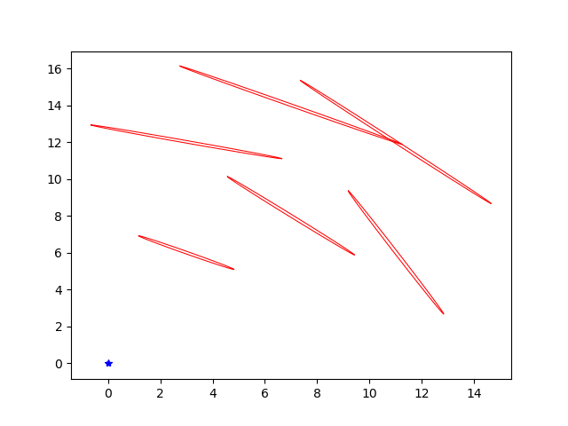
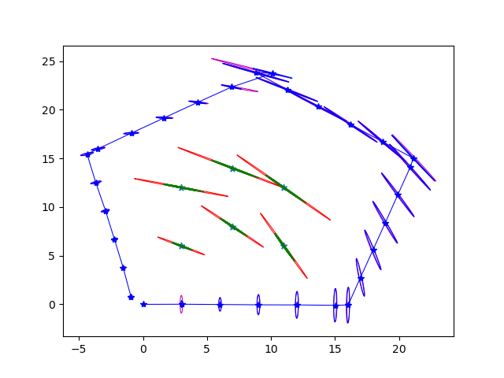

# ekf_slam
Repository for solving a toy 2D EKF SLAM problem in Python with fixed landmarks and known data associations. Done as part of CMU 16833.

The map assumes 6 landmarks. 
State consists of a 15x1 vector  - 6x2(lx,ly for 6 landmarks) + 3(for robot pose x,y, theta)
## Data
data logs are in `data/data.txt`. The measurement data comes in as a bearing and range reading . The control data comes in as translation and angle measured from the last reading.

Control data example-
```
3.0000	0.0000 
```
Robot first translates and then turns in place

Range and bearing data example-
```
1.1072	6.7060	1.3257	12.3812	0.8520	10.6270	1.1071	15.6513	0.4995	12.5422	0.8289	16.2816	
```
are range and bearing values for 6 landmarks. The associations are assumed to be correct everytime.


## Results
Robot moves in a pentagonal trajectory and the 6 landmarks are in the middle.

 

 
